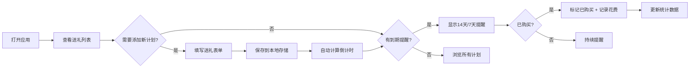

## 1. 产品概述

礼物管理工具是一款帮助用户系统化管理送礼计划的个人效率工具。解决用户忘记重要送礼日期、预算失控、送礼准备仓促等痛点，目标用户为需要维护社交关系、重视礼尚往来的都市人群。

产品价值：通过智能化提醒和系统化管理，让每一份心意都准时送达，避免社交尴尬，提升人际关系维护效率。

## 2. 核心 Features

### 2.1 用户角色

| 角色 | 注册方式 | 核心权限 |
|------|----------|----------|
| 普通用户 | 无需注册，本地存储 | 添加/编辑/删除送礼计划、标记购买状态、查看提醒 |

### 2.2 Feature Module

1. **首页（送礼列表）**：送礼计划卡片列表、按日期排序、状态筛选、提醒标识
2. **添加/编辑送礼计划**：表单录入送礼场景、收礼人信息、日期、预算
3. **提醒中心**：即将到期提醒列表、14天/7天提醒标识
4. **统计概览**：年度送礼统计、预算 vs 实际花费分析

### 2.3 Page Details

| 页面名称 | 模块名称 | 功能描述 |
|---------|----------|----------|
| 首页 | 送礼计划列表 | 卡片式展示所有送礼计划，按距离日期升序排列，显示倒计时、关系标签、预算金额 |
| 首页 | 快速添加按钮 | 悬浮按钮快速打开添加送礼计划弹窗 |
| 首页 | 筛选功能 | 按状态（全部/待准备/已购买）、按关系（亲戚/朋友/同事）筛选 |
| 首页 | 提醒标识 | 距离日期≤14天显示橙色提醒，≤7天显示红色紧急提醒 |
| 添加/编辑页 | 表单模块 | 送礼场景下拉、收礼人姓名、关系选择、日期选择、预算输入 |
| 添加/编辑页 | 场景预设 | 内置生日、婚礼、满月酒、春节、乔迁等常见场景 |
| 详情弹窗 | 状态管理 | 标记已购买、输入实际花费、添加备注 |
| 提醒中心 | 提醒列表 | 集中展示需要准备的礼物，按紧急程度排序 |

## 3. Core Process

用户打开应用 → 查看送礼计划列表 → 识别紧急/即将到期的提醒 → 点击添加新计划 → 填写表单保存 → 系统自动排序并计算倒计时 → 临近日期时显示提醒标识 → 购买后标记已购买并记录实际花费 → 查看统计分析

## 4. User Interface Design

### 4.1 Design Style

- **主色调**：暖红色系 `#E63946`（代表礼物、喜庆、热情），辅助色为金色 `#FFB703` 和暖粉色 `#F4A261`
- **背景色**：暖米色 `#FFF8F0` 营造温馨氛围，卡片使用纯白色带柔和阴影
- **按钮风格**：圆润胶囊型按钮，主按钮使用渐变填充，hover时有微放大动效
- **字体**：标题使用「LXGW WenKai」或「Ma Shan Zheng」等有温度的中文字体，正文使用现代无衬线字体
- **布局风格**：卡片式瀑布流布局，顶部导航栏，浮动操作按钮
- **图标风格**：使用 Emoji 图标增强亲和力，如 🎁、🎂、🎊、🏠、👶 等

### 4.2 Page Design Overview

| 页面名称 | 模块名称 | UI Elements |
|---------|----------|-------------|
| 首页 | 顶部导航 | 渐变背景、标题"我的礼物清单"、提醒铃铛图标（显示未读提醒数） |
| 首页 | 统计概览 | 三个圆角卡片展示：即将到来、本月预算、已完成数量 |
| 首页 | 礼物列表 | 纵向排列卡片，左侧显示倒计时色块，右侧显示送礼详情 |
| 首页 | 倒计时块 | ≤7天红色渐变，≤14天橙色渐变，>14天绿色渐变 |
| 添加表单 | 弹窗设计 | 半透明背景模糊，居中卡片带柔和阴影，底部固定保存按钮 |
| 添加表单 | 场景选择 | 可横向滚动的场景标签，选中时有高亮动效 |
| 详情弹窗 | 状态切换 | 开关式切换"已购买"状态，显示实际花费输入框 |

### 4.3 Responsiveness

- 桌面端优先设计，适配 1440px 宽度
- 移动端自适应：卡片宽度 100%，单列布局，底部浮动按钮
- 触摸屏优化：按钮最小高度 48px，点击区域充足
- 响应式断点：768px 切换为移动端布局

### 4.4 交互动效

- 页面加载时卡片依次淡入（staggered animation）
- 提醒卡片有轻微呼吸动效吸引注意
- 表单提交成功有对勾动画反馈
- 滑动删除送礼计划（移动端）
