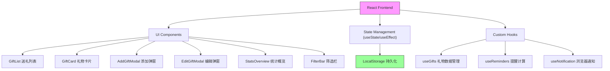

## 1. Architecture Design



## 2. Technology Description

- **前端**: React@18 + TypeScript + Vite@5
- **样式**: TailwindCSS@3 + CSS 变量自定义主题
- **图标**: Lucide React + Emoji 组合
- **数据持久化**: localStorage（无需后端）
- **通知**: 浏览器 Notification API
- **日期处理**: 原生 Date API（轻量，无需额外依赖）
- **初始化工具**: vite-init

## 3. Route Definitions

本项目为单页应用，使用状态切换而非路由：

| 视图状态 | 用途 |
|---------|------|
| 默认视图 | 送礼列表 + 统计概览 + 筛选 |
| 添加弹窗 | 新增送礼计划表单 |
| 编辑弹窗 | 修改已有送礼计划 |
| 详情弹窗 | 查看详情 + 标记已购买 + 记录花费 |

## 4. API Definitions

无后端服务，所有数据操作通过 localStorage 完成。

### 核心数据类型定义

```typescript
// 送礼场景类型
type GiftScene = 'birthday' | 'wedding' | 'baby' | 'springFestival' | 'housewarming' | 'anniversary' | 'graduation' | 'other';

// 关系类型
type Relationship = 'relative' | 'friend' | 'colleague';

// 送礼计划数据结构
interface GiftPlan {
  id: string;
  scene: GiftScene;
  customScene?: string; // 当scene为other时使用
  recipientName: string;
  relationship: Relationship;
  giftDate: string; // ISO date string YYYY-MM-DD
  budget: number;
  actualCost?: number;
  isPurchased: boolean;
  purchaseDate?: string;
  notes?: string;
  createdAt: string;
  updatedAt: string;
}

// 提醒级别
type ReminderLevel = 'none' | 'normal' | 'urgent';

// 带提醒信息的送礼计划
interface GiftPlanWithReminder extends GiftPlan {
  daysRemaining: number;
  reminderLevel: ReminderLevel;
  isOverdue: boolean;
}

// 筛选条件
interface FilterOptions {
  status: 'all' | 'pending' | 'purchased';
  relationship: 'all' | Relationship;
}
```

### LocalStorage 操作接口

```typescript
// 存储键名
const STORAGE_KEY = 'gift_manager_plans';

// 操作方法
interface GiftStorage {
  getAll(): GiftPlan[];
  getById(id: string): GiftPlan | undefined;
  create(plan: Omit<GiftPlan, 'id' | 'createdAt' | 'updatedAt'>): GiftPlan;
  update(id: string, updates: Partial<GiftPlan>): GiftPlan | undefined;
  delete(id: string): boolean;
  markAsPurchased(id: string, actualCost: number): GiftPlan | undefined;
}
```

## 5. Data Model

### 5.1 Data Model Definition

```mermaid
erDiagram
    GIFT_PLAN {
        string id PK "唯一标识"
        string scene "送礼场景"
        string customScene "自定义场景"
        string recipientName "收礼人姓名"
        string relationship "关系"
        string giftDate "送礼日期"
        number budget "预算金额"
        number actualCost "实际花费"
        boolean isPurchased 是否已购买
        string purchaseDate "购买日期"
        string notes "备注"
        string createdAt "创建时间"
        string updatedAt "更新时间"
    }
```

### 5.2 数据存储格式

```json
// localStorage 存储示例
[
  {
    "id": "uuid-12345",
    "scene": "birthday",
    "recipientName": "张三",
    "relationship": "friend",
    "giftDate": "2026-07-15",
    "budget": 500,
    "actualCost": null,
    "isPurchased": false,
    "notes": "喜欢电子产品",
    "createdAt": "2026-06-01T10:00:00Z",
    "updatedAt": "2026-06-01T10:00:00Z"
  }
]
```

## 6. 核心工具函数

### 6.1 日期计算

```typescript
// 计算距离目标日期的天数
function calculateDaysRemaining(targetDate: string): number;

// 获取提醒级别
function getReminderLevel(daysRemaining: number): ReminderLevel;

// 格式化日期显示
function formatDate(dateStr: string): string;
```

### 6.2 排序和筛选

```typescript
// 按距离日期排序（升序，过期的排最后）
function sortByDateRemaining(plans: GiftPlanWithReminder[]): GiftPlanWithReminder[];

// 筛选送礼计划
function filterPlans(plans: GiftPlanWithReminder[], filters: FilterOptions): GiftPlanWithReminder[];
```

### 6.3 通知功能

```typescript
// 请求通知权限
async function requestNotificationPermission(): Promise<boolean>;

// 检查并发送到期提醒
function checkAndSendReminders(plans: GiftPlan[]): void;
```
